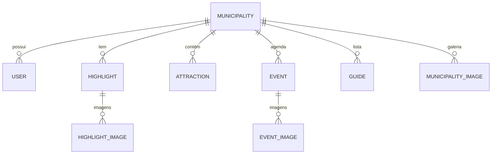

# Documentação Técnica: Adetur Gestão

## 1. Visão Geral
O **Adetur Gestão** é um ecossistema de gerenciamento turístico desenvolvido para a ADETUR. O sistema centraliza a gestão de municípios, atrações, eventos e guias, servindo como a "coluna vertebral" de dados para portais turísticos e administração regional.

---

## 2. Arquitetura do Sistema

O projeto segue uma arquitetura moderna baseada em **Next.js 15 (App Router)**, utilizando o padrão de **Server-side Rendering (SSR)** e **API Routes** para comunicação.

### 2.1. Stack Tecnológica
- **Framework**: Next.js 15 (React 19)
- **Linguagem**: TypeScript
- **Autenticação**: Clerk (Auth-as-a-Service)
- **Banco de Dados**: PostgreSQL (via Supabase)
- **ORM**: Prisma
- **Processamento de Imagem**: Sharp
- **Storage**: Supabase Storage
- **UI/UX**: Tailwind CSS 4 + shadcn/ui + Framer Motion

### 2.2. Fluxo de Requisição
```mermaid
graph LR
    User((Usuário)) -> Frontend[Next.js App Router]
    Frontend -> Auth{Clerk Middleware}
    Auth -- Protegido --> API[API Routes / Server Actions]
    Auth -- Público --> API
    API -> Prisma[Prisma Client]
    Prisma -> DB[(PostgreSQL)]
    API -> Storage[Supabase Storage]
```

---

## 3. Detalhamento do Backend

### 3.1. Camada de Dados (Modelo de Entidades)
O banco de dados é modelado com foco na hierarquia municipal. A entidade principal é o `Municipality`.



**Principais Modelos:**
- **User**: Gerenciado em conjunto com o Clerk via `clerkId`. Pode ser vinculado a um município específico.
- **Municipality**: Armazena dados geográficos, históricos e administrativos (IBGE, Prefeito, etc.).
- **Highlight (Destaques)**: Pontos ou locais que ganham visibilidade no portal.
- **Post**: Entidade para o sistema de Blog e Notícias, suportando conteúdo rico (HTML/JSON via Tiptap).

### 3.2. Estratégia de API
Os endpoints estão localizados em `src/app/api` e seguem o padrão RESTful dentro das convenções do Next.js:
- `GET`: Recuperação de listas ou itens individuais (muitas vezes públicos).
- `POST/PUT/DELETE`: Operações de escrita protegidas por autenticação Clerk.

### 3.3. Autenticação e Segurança
- **Middleware (`src/middleware.ts`)**: Intercepta todas as requisições para `/admin(.*)`. Utiliza o Clerk para verificar sessões ativas.
- **Proteção de API**: Endpoints sensíveis utilizam `const { userId } = await auth();` do Clerk para validar a identidade antes de processar dados.

---

## 4. Gestão de Mídia e Storage

O sistema utiliza o **Supabase Storage** (bucket `adetur-bucket`) para persistência de assets.

### 4.1. Processo de Upload
1. O cliente envia um `FormData` via POST/PUT.
2. O servidor extrai o arquivo e utiliza o **Sharp** para:
   - Redimensionar (máx 1200px largura).
   - Converter para **WebP** (80% qualidade) para otimização de performance e SEO.
3. O buffer processado é enviado ao Supabase Storage.
4. A URL pública resultante é salva no banco de dados via Prisma.

### 4.2. Localização dos Arquivos
Os arquivos são organizados de forma hierárquica no bucket:
`cities/{municipalityId}/{category}/{id}/{filename}.webp`

---

## 5. Estrutura de Pastas e Padrões

- `src/app/api`: Camada de backend (endpoints).
- `src/lib`: Configurações de clientes (Prisma, Supabase, etc.) e serviços core.
- `src/components`: UI components e lógica de interface.
- `prisma/`: Definição do esquema e migrações do banco.
- `src/generated/`: Cliente Prisma gerado automaticamente (tipagem forte).

---

## 6. Guia de Desenvolvimento

### 6.1. Comandos Principais
- `npm run dev`: Inicia o servidor de desenvolvimento.
- `npx prisma generate`: Atualiza o cliente Prisma baseado no `schema.prisma`.
- `npx prisma migrate dev`: Cria e aplica migrações ao banco de dados.
- `npx prisma studio`: Interface visual para gerenciar dados do banco local/remoto.

### 6.2. Variáveis de Ambiente (.env)
```env
DATABASE_URL=          # URL de conexão via pooler
DIRECT_URL=            # URL de conexão direta (migrações)
NEXT_PUBLIC_CLERK_PUBLISHABLE_KEY=
CLERK_SECRET_KEY=
NEXT_PUBLIC_SUPABASE_URL=
SUPABASE_SERVICE_KEY=  # Apenas servidor
```

---

## 7. Manutenção e Escalabilidade
A arquitetura foi pensada para ser **Stateless**, facilitando o escalonamento em plataformas como Vercel. O uso do Prisma com Supabase permite a utilização de **Prisma Accelerate** (configurado via `prisma/extension-accelerate`) para caching global de queries, garantindo baixa latência em requisições de leitura.
